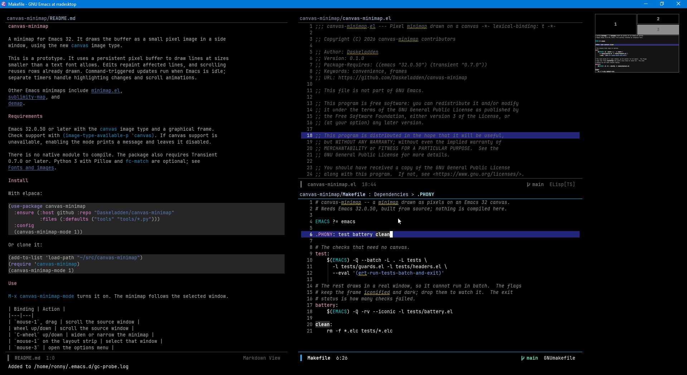

# canvas-minimap

A minimap for Emacs 32. It draws the buffer as a small pixel image in a side
window, using the new `canvas` image type.



This is a prototype. It uses a persistent pixel buffer to draw lines at sizes
smaller than a text font allows. Edits repaint affected lines, and scrolling
reuses rows already drawn. Command-triggered updates run when Emacs is idle;
separate timers handle highlighting changes and scroll animations.

Other Emacs minimaps include [minimap.el](https://elpa.gnu.org/packages/minimap.html),
[sublimity-map](https://github.com/zk-phi/sublimity), and
[demap](https://github.com/emacsmirror/demap).

## Requirements

Emacs 32.0.50 or later with the `canvas` image type and a graphical frame.
Check support with `(image-type-available-p 'canvas)`. If canvas support is
unavailable, enabling the mode prints a message and leaves it disabled.

There is no native module to compile. The package also requires Transient
0.7.0 or later. Python 3 with Pillow and `fc-match` are optional; see
[Fonts and images](#fonts-and-images).

## Install

With elpaca:

```elisp
(use-package canvas-minimap
  :ensure (:host github :repo "Daskeladden/canvas-minimap"
           :files (:defaults ("tools" "tools/*.py")))
  :config
  (canvas-minimap-mode 1))
```

Or clone it:

```elisp
(add-to-list 'load-path "~/src/canvas-minimap")
(require 'canvas-minimap)
(canvas-minimap-mode 1)
```

## Use

`M-x canvas-minimap-mode` turns it on. The minimap follows the selected window.

| Binding | Action |
|---|---|
| `mouse-1`, drag | scroll the source window |
| wheel up/down | scroll the source window |
| `C-wheel` up/down | widen or narrow the minimap |
| `mouse-1` on the layout strip | select that window |
| `mouse-3` | open the options menu |

`canvas-minimap-set-width`, `canvas-minimap-widen` and `canvas-minimap-narrow`
change the width. `canvas-minimap-refresh` redraws everything.

`M-x canvas-minimap-menu` opens the options menu. Press an option's key to
toggle it, cycle through its choices, or enter a value at a prompt. Prompted
values are previewed as you type, including completion candidates in Vertico
and Icomplete. Press `C-g` to restore the previous value.

Options disabled by another setting are dimmed, with the reason shown beside
them. Changes apply to the current session. Press `C` to open Customize and
save them.

## What it shows

- Buffer text, including indentation and blank lines, coloured by its faces.
- Overlay highlights, including the region, `hl-line` and pulses.
- A fringe strip showing overlay-based marks from packages such as diff-hl,
  Flycheck, Flymake and dape, as well as bookmarks.
- A highlight for the visible portion of the buffer and a marker for point.
- Image thumbnails, sized to account for the space images occupy in the buffer.
- Matching lines while you type in `consult-line`.
- An optional window layout strip. Set `canvas-minimap-layout-height` to
  enable it. By default, it appears only when the frame has multiple windows.
  Click a pane to select its window. If ace-window is installed, panes also
  show their selection keys.
- Animated scrolling when you jump to a distant part of the buffer.

## Options

`M-x customize-group RET canvas-minimap RET` lists all options. Some useful
settings:

| Option | Default | Description |
|---|---|---|
| `canvas-minimap-width` | 110 | window width in pixels |
| `canvas-minimap-line-height` | 3 | pixel rows per buffer line |
| `canvas-minimap-column-width` | 1 | pixel columns per buffer column |
| `canvas-minimap-placement` | `frame` | one per frame, or `window` for one per window |
| `canvas-minimap-side` | `right` | which side it sits on |
| `canvas-minimap-gutter-width` | 3 | fringe strip width in pixels; 0 turns it off |
| `canvas-minimap-layout-height` | nil | height of the layout strip; `auto` is a quarter of the width |
| `canvas-minimap-layout-always` | nil | show the layout strip even with a single window |
| `canvas-minimap-viewport-style` | `tint` | viewport highlight style: `tint`, `outline`, or `both` |
| `canvas-minimap-smooth-scroll` | t | animate jumps |
| `canvas-minimap-highlight-matches` | t | mark the lines a completion matches |
| `canvas-minimap-image-thumbnails` | t | downsample images, rather than draw a block |
| `canvas-minimap-exclude-modes` | image, doc-view, pdf-view, vterm, term | modes excluded from the minimap |

For a larger minimap:

```elisp
(setq canvas-minimap-width 250
      canvas-minimap-line-height 5
      canvas-minimap-line-gap 1
      canvas-minimap-column-width 2)
```

## Fonts and images

The package includes a glyph table generated from JetBrains Mono. When a
different font is used, it generates a table in the background and caches it
for later use. Generation uses `tools/gen-glyph-table.py` and requires
`fc-match` and Python 3 with Pillow. If these are unavailable, the bundled
table is used. Run `M-x canvas-minimap-regenerate-glyph-table` to rebuild a
font's table.

Image thumbnails are generated in the background by `tools/gen-image-thumb.py`
and cached for the session. This also requires Python 3 with Pillow. Without
it, images appear as plain blocks of the appropriate size.

## Custom thumbnails

Packages that draw their own canvases, diagrams or plots can supply thumbnail
pixels directly. This also supports images without a backing file.

Add a function to `canvas-minimap-thumbnail-functions`. It receives the image
spec, requested width and height in pixels, and background colour as ARGB32.
Return a vector of `width * height` ARGB32 pixels in row-major order, or `nil`
to let the next function try. An invalid return value raises an error. If no
function supplies pixels, the minimap falls back to reading the image file.
Call `canvas-minimap-picture-changed` when the image changes to request a redraw.

To handle clicks on a supplied thumbnail, add a function to
`canvas-minimap-picture-click-functions`. It receives the image spec and the
click's x and y coordinates as fractions from 0 to 1. Return non-nil to mark
the click as handled and prevent normal buffer scrolling. The hook also runs
during dragging, allowing a thumbnail to control panning.

```elisp
(with-eval-after-load 'canvas-minimap
  (add-hook 'canvas-minimap-thumbnail-functions #'my-thumbnail)
  (add-hook 'canvas-minimap-picture-click-functions #'my-picture-click))
```

A package can use these hooks to display a scaled-down diagram and pan it
when the user clicks or drags its thumbnail.

## Limitations

- Only printable ASCII has individual glyph shapes. Accented letters, Chinese,
  Japanese, Korean and box-drawing characters appear as shaded blocks of
  the appropriate width.
- Line wrapping is not modelled. A line that wraps over three screen lines
  still gets one row of the map.
- Fringe marks are read from overlays, so `diff-hl-margin-mode` and anything
  else using text properties will not show.
- The minimap covers a slice around the source window, not the whole buffer,
  so search marks only appear for the lines it is drawing.

## Tests

```sh
make test       # in batch, no display needed
make battery    # draws for real, needs a graphical display
```

`make test` runs the headless checks for input guards, the thumbnail and click
hooks, package headers, and the licence file.

`make battery` exercises rendering, editing, folding, narrowing, mouse input
and the options menu. It compares incremental rendering with a full redraw.
The command starts Emacs with `-Q -rv --iconic` for an iconified frame with a
dark background; remove `-rv --iconic` from the command in the Makefile to
watch it run. The exit status is the number of failed checks.

## Feedback

Issues and patches are welcome. For display or performance problems, include
your Emacs build, font, display scaling, whether the display is local or
remote, and steps to reproduce the problem.

## License

GPL-3.0-or-later. See [LICENSE](LICENSE).
